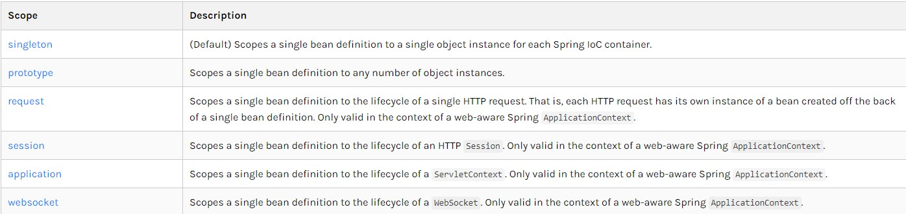

# Spring

# 1、Spring

## 1.1简介 

* Spring：春天——>给软件行业带来了春天
* 2002，首次推出了Spring框架的雏形：interface框架！
* Spring框架即以interface21框架为基础，经过重新设计，并不断丰富其内涵，于2004年3月24日，发布了1.0正式版
* Rod Johnson，Spring Framework创始人，著名作者。很难想象Rod Johnson的学历，真的让好多人大吃一惊，他是悉尼大学的博士，然而他的专业不是计算机，而是音乐学。
* 
* spring理念：使现有的技术更加容易使用，本身是一个大杂烩。
* 
* SSH：Struct2 + Spring + Hibernate
* 
* SSM: SpringMVC + Spring + Mybatis
* 官网：https://spring.io/projects/spring-framework#overview
* 官方下载地址：https://repo.spring.io/ui/native/release/org/springframework/spring
* 官方文档：https://docs.spring.io/spring-framework/docs/5.2.0.RELEASE/spring-framework-reference/index.html
* maven包：
* spring-webmvc
* spring-jdbc

## 1.2优点 

* Spring是一个开源的免费框架
* Spring是一个轻量级的，非入侵式的框架
* 控制反转(IOC)，面向切面编程(AOP)
* 支持事务的处理，对框架整合的支持
* 总结：Spring是一个轻量级的控制反转(IOC)和面向切面编程(AOP)的框架

## 1.3组成 


## 1.4 
1.UserDao接口

2.UserDaoImpl实现类

3.UserService业务接口

4.UserServiceImpl业务实现类

在之前的业务中，用户的需求可能会影响原本的代码，程序员需要根据用户的需求去修改源代码！如果程序代码量十分大，修改一次的成本代价十分昂贵！
使用Set接口实现，发生了革命性的变化

# 2.IOC理论推导
控制反转IoC(Inversion of Control)，是一种设计思想，DI(依赖注入)是实现IoC的一种方法，也有人认为DI只是IoC的另一种说法。在没有IoC的程序中，我们使用面向对象编程，对象的创建与对象间的依赖关系完全硬编码在程序中，对象的创建由程序自己控制，控制反转后将对象的创建转移给第三方，个人认为所谓控制反转就是：获得依赖对象的方式反转了。
采用XML方式配置Bean的时候，Bean的定义信息是和实现分离的，而采用注解的方式可以把二者合为一体，Bean的定义信息直接以注解的形式定义在实现类中，从而达到了零配置的目的。
控制反转是一种通过描述(XML或注解)并通过第三方去生产或获取特定对象的方式。在Spring中实现控制反转的是IoC容器，其实现方法是依赖注入(Dependenccy Injection,DI)。

IOC是一种编程思想，由主动编程变成了被动接收
可以通过newClassPathXmlApplicationContext去浏览一下底层源码，
ok，到了现在，我们彻底不用再去程序中进行改动了，要实现不同的操作，只需要在xml配置文件中进行修改，所谓的IOC，一句话搞定：对象由Spring创建，管理，装配！

# 3、IOC创建对象的方式

## 3.1使用无参构造创建对象，默认！
*必须有无参构造方法

3.2、假设我们要使用有参构造构建对象

* 下标赋值
```xml
<!--下标赋值-->
  <bean id="user" class="com.gty.pojo.User">
      <constructor-arg index="0" value="tiantian"/>
  </bean>
```

* 类型赋值
```xml
<!--类型赋值（不建议使用）-->
  <bean id="user" class="com.gty.pojo.User">
      <constructor-arg type="java.lang.String" value="tiantian"/>
  </bean>
```

* 参数名赋值
```xml
<!--参数名赋值-->
  <bean id="user" class="com.gty.pojo.User">
      <constructor-arg name="name" value="tiantian"/>
  </bean>
```

当在xml配置文件加载时，容器中管理里的对象就已经初始化了（注册bean时就已经被实例化了），无需等到getBean()

# 4、Spring配置
## 4.1 别名
```xml
<!--别名，如果添加了别名，也可以通过别名获取到这个对象-->
  <alias name="user" alias="usernew"/>
```

```java
ApplicationContext context=new ClassPathXmlApplicationContext("beans.xml");
      User user=(User)context.getBean("usernew");
      user.show(); // 输出内容
```

## 4.2 Bean的配置
```xml
<!--
  id：bean的唯一标识符，相当于学过的对象名
  class：bean对象所对应的全限定名：包名+类型
  name：也是别名,name可以取多个别名
  -->
  <bean id="usertt" class="com.gty.pojo.UserT" name="usergg,useryy userty;usergty">
      <property name="name" value="gtygty"/>
  </bean>
```

## 4.3 import
import一般用于团队开发使用，他可以将多个配置文件导入合并为一个。
假设现在项目中有多个人开发，这三个人负责不同的类开发，不同的类需要注册在不同的bean中，我们可以利用import将所有人的beans.xml合并为一个总的applicationContext.xml
```xml
<import resource="beans.xml"/>
<import resource="bean1.xml"/>
<import resource="bean2.xml"/>
<import resource="bean3.xml"/>
```

# 5、依赖注入

## 5.1 构造器注入

## 5.2 *Set方式注入
依赖注入：set注入依赖注入：set注入
* 依赖：bean对象的创建依赖于容器
* 注入：bean对象中的所有属性，由容器来注入

* beans.xml
各种方式注入
```java 
  private String name;
  private String address;
  private String[] books;
  private List<String> hobbies;
  private Map<String,String> card;
  private Set<String> games;
  private String wife;
  private Properties info;
```
完善注入

```xml
<bean id="address" class="com.gty.pojo.Address">
      <property name="address" value="xuzhou"/>
  </bean>
  <bean id="student" class="com.gty.pojo.Student">
      <!--第一种，普通值注入，value-->
      <property name="name" value="天天"/>
      <!--第二种，Bean注入，ref-->
      <property name="address" ref="address"/>
      <!--第三种，数组注入,-->
      <property name="books" >
          <array>
              <value>红楼梦</value>
              <value>水浒传</value>
              <value>西游记</value>
          </array>
      </property>
      <!--第四种，List集合注入-->
      <property name="hobbies">
          <list>
              <value>读书</value>
              <value>画画</value>
              <value>跑步</value>
          </list>
      </property>
      <!--第五种，Map集合注入-->
      <property name="card">
          <map>
              <entry key="银行卡" value="545121212"/>
              <entry key="身份证" value="545121212"/>
          </map>
      </property>
      <!--第六种，Set集合注入-->
      <property name="games">
          <set>
              <value>ppt</value>
              <value>doc</value>
              <value>vvc</value>
          </set>
      </property>
      <!--第七种，null-->
      <property name="wife" value="null"/>
      <!--第八种，properties-->
      <property name="info">
          <props>
              <prop key="学号">2050214801</prop>
              <prop key="性别">男</prop>
              <prop key="姓名">张飒</prop>
          </props>
      </property>
  </bean>
```

## 5.3 扩展方式注入
我们可以使用p命令空间和c命令空间进行注入
* 使用
```xml
<?xml version="1.0" encoding="UTF-8"?>
<beans xmlns="http://www.springframework.org/schema/beans"
     xmlns:xsi="http://www.w3.org/2001/XMLSchema-instance"
     xmlns:p="http://www.springframework.org/schema/p"
     xmlns:c="http://www.springframework.org/schema/c"
     xsi:schemaLocation="http://www.springframework.org/schema/beans
     http://www.springframework.org/schema/beans/spring-beans.xsd">
  <!--p命名空间注入，可以直接注入属性的值，property-->
  <bean id="user" class="com.gty.pojo.User" p:name="tiantian" p:age="19"/>
  <!--c命名空间注入，通过构造器注入，construct-args-->
  <bean id="user2" class="com.gty.pojo.User" c:age="23" c:name="gty"/>
</beans>
```
* 测试
```java
@Test
public void test2(){
ApplicationContext context=new ClassPathXmlApplicationContext("userbeans.xml");
User user= context.getBean("user",User.class);
System.out.println(user);
  
```

## 5.4 Bean的作用域


* 单例模式(spring默认机制)
<bean id="user2" class="com.gty.pojo.User" c:age="23" c:name="gty" scope="singleton"/>

* 原型模式：每次从容器中get时，都会产生一个新的对象
<bean id="user2" class="com.gty.pojo.User" c:age="23" c:name="gty" scope="prototype"/>

* 重点在scope

# 6.自动装配

* 自动装配是Spring满足bean依赖的一种方式
* Spring会在上下文中自动寻找，并自动给bean装配属性
在Spring中有三种装配方式：
1.在xml中显式配置
2.在java中显式配置
3.隐式的自动装配bean(重要)

## 6.1 ByName自动装配
```xml
<!--byName:会自动在容器上下文查找，和自己对象set方法后面的值对应的bean id-->
  <bean id="person" class="com.gty.pojo.Person" autowire="byName">
      <property name="name" value="天天"/>
<!--        <property name="cat" ref="cat"/>-->
  </bean>
```

## 6.2 ByType自动装配
```xml
<bean id="cat" class="com.gty.pojo.Cat"/>
  <bean id="dog" class="com.gty.pojo.Dog"/>
  <!--byType:会自动在容器上下文查找，和自己对象属性类型相同的bean-->
  <bean id="person" class="com.gty.pojo.Person" autowire="byType">
      <property name="name" value="天天"/>
<!--        <property name="cat" ref="cat"/>-->
  </bean>
```
* 注意autowire
* byName，需要保证所有bean的id唯一，并且这个bean需要和自动注入的属性的set方法的值一致。
* byType，需要保证所有bean的class唯一，并且这个bean需要和自动注入的属性的类型一致。

## 6.3 使用注解实现自动装配
jdk1.5支持的注解，Spring2.5就支持注解了
使用注解须知：
1.导入约束:context约束
2.配置注解的支持:context:annotation-config/

* beans.xml的依赖
```xml
<?xml version="1.0" encoding="UTF-8"?>
<beans xmlns="http://www.springframework.org/schema/beans"
     xmlns:xsi="http://www.w3.org/2001/XMLSchema-instance"
     xmlns:context="http://www.springframework.org/schema/context"
     xmlns:aop="http://www.springframework.org/schema/aop"
     xsi:schemaLocation="http://www.springframework.org/schema/beans
     https://www.springframework.org/schema/beans/spring-beans.xsd
     http://www.springframework.org/schema/context
     https://www.springframework.org/schema/context/spring-context.xsd
     http://www.springframework.org/schema/aop
     https://www.springframework.org/schema/aop/spring-aop.xsd">
  <!--开启注解支持-->
  <context:annotation-config/>
```
`@Autowired`:
直接在属性上使用即可！也可以在set方式上使用！
```java
public class People {
  @Autowired
  private Cat cat;
  @Autowired
  private Dog dog;
  @Autowired
  public void setCat(Cat cat) {
      this.cat = cat;
  }
```

* 使用Autowired我们可以不用编写Set方法，前提是这个自动装配的属性在IOC(Spring)容器中存在，且符合名字byName！
* 如果`@Autowired`自动装配的环境比较复杂，自动装配无法通过一个注解`@Autowired`完成的时候 ，可以使用`@Qualifier(“xxx”)`去配合`@Autowired`的使用，即既无法通过`byName`又无法通过`byType`时，指定一个唯一的bean对象注入

```java
  // 此为beans.xml 
  <bean id="cat1111" class="com.gty.pojo.Cat"/>
  <bean id="cat222" class="com.gty.pojo.Cat"/>
  <bean id="dog1111" class="com.gty.pojo.Dog"/>
  <bean id="dog222" class="com.gty.pojo.Dog"/>
  // 测试类
  public class People {
  @Autowired
  @Qualifier("cat222")
  private Cat cat;
  @Autowired
  @Qualifier("dog222")
  private Dog dog;
```

`@Resource注解`
```java
public class People {
  @Resource(name="cat1111")
  private Cat cat;
  @Resource
  private Dog dog;
```

`@Autowired`和`@Resource`区别:
* 都是用来自动装配的，都可以放在属性字段上
* @Autowired通过byType实现，必须要求这个对象存在
* @Resoutce默认通过byName方式实现，如果找不到名字，则通过byType实现
* 执行顺序不同：@Autowired通过byType实现，@Resoutce通过byName实现


# 7.使用Java方式配置Spring

可以完全不使用Spring的xml配置，全权交给Java实现！
JavaConfig是Spring的一个子项目，在Spring4之后变为核心功能。

* 实体类
```java
//@Component意思是这个类被Spring托管了，注册到了容器中
@Component
public class User {
  private String name;
  public String getName() {
      return name;
  }
  @Value("tiantian")
  public void setName(String name) {
      this.name = name;
  }
  @Override
  public String toString() {
      return "User{" +
              "name='" + name + '\'' +
              '}';
  }
}
```

* 配置类
```java
//@Configuration是一个配置类，和之前的beans.xml是一样的
@Configuration//这个也会被Spring容器托管，注册到容器中，因为它本来也是一个@Component
@Import(GtyConfig2.class)
public class GtyConfig {
  //注册一个Bean，就相当于之前写的一个Bean标签
  //这个方法的名字，相当于bean标签中的id属性
  //这个方法的返回值，就相当于bean标签中的class属性
  @Bean
  public User getUser(){
      return new User();//就是返回要注入到bean的对象
  }
}
```

* 测试类
```java
public class MyTest {
  public static void main(String[] args) {
//如果完全使用了配置类方式去做，我们就只能通过AnnotationConfig上下文来获取容器，通过配置类的class对象加载
      ApplicationContext context=new AnnotationConfigApplicationContext(GtyConfig.class);
      User getUser=context.getBean("getUser",User.class);
      System.out.println(getUser.getName());
  }
}
```