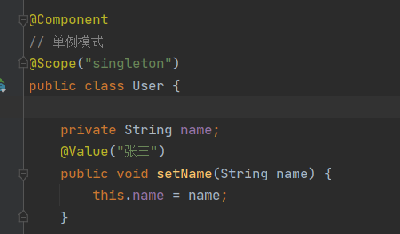

## 注解开发

## 1.bean

```xml
<!--指定要扫描的包，这个包下的注解就会生效-->
<context:component-scan base-package="com.gty.pojo"/>
        <!--开启注解支持-->
<context:annotation-config/>
```


## 2.属性注入
可以放在属性上或者set方法上
```java
@Component //@Component意思是这个类被Spring托管了，注册到了容器中
public class User {
  //相当于<property name="name" value="tiantian"/>
  @Value("tiantian")
  public String name;
  //相当于<property name="name" value="tiantian"/>
  @Value("tiantian")
  public void setName(String name) {
      this.name = name;
  }
}
```

## 3.衍生的注解
```text
@Component有几个衍生注解，我们在web开发中会按照mvc三层架构分层
dao [@Repository]
pojo [@Component]
service [@Service]
controller [@Controller]
这四个注解功能都是一样的，都是代表将某个类注册到Spring中，装配bean
```

## 4.自动装配

```text
@Autowired：自动装配通过类型和名字
如果@Autowired不能唯一自动装配上属性，则需要通过@Qualifier(value=”xxx”)
@Nullable:某个字段标记了这个注解，说明这个字段可以为空
@Resoure:自动装配通过名字、类型
```

## 5.作用域

```java
@Component
@Scope("prototype") // 原型模式
public class User {
  public String name;
  //相当于<property name="name" value="tiantian"/>
  @Value("tiantian")
  public void setName(String name) {
      this.name = name;
  }
}
```
